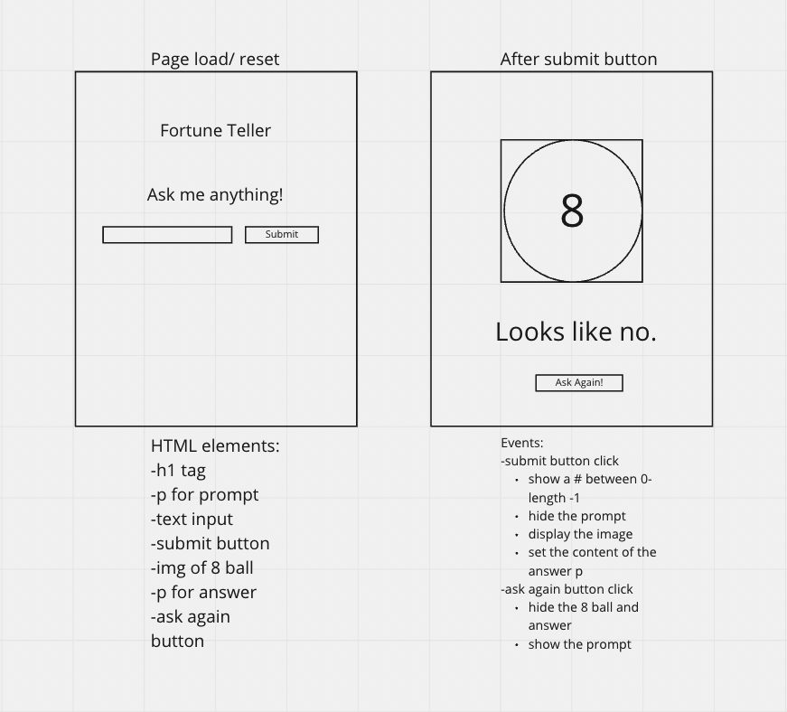

# plan

-Add my event listener to my submit button 
-pick a random number between 0 and length -1 
-hide the prompt 
-display the image 
-set the content of the answer p to the random choice

## part two

-Add my event listener to my reset button 
-hide the 8 ball and answer 
-show the prompt
